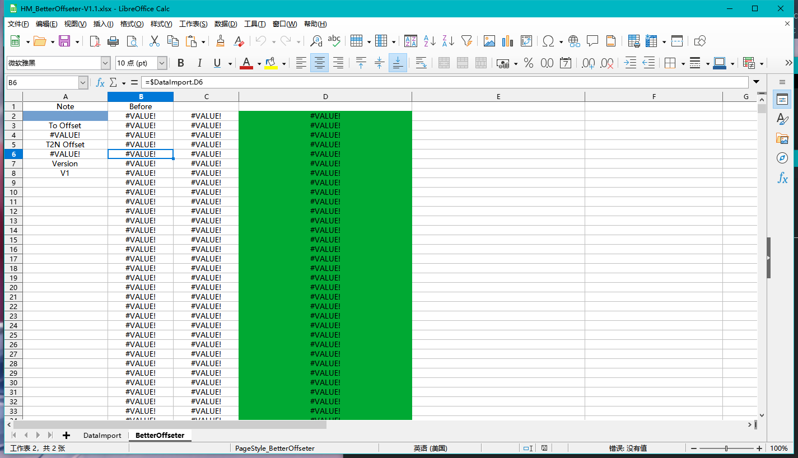

## Better Offseter

---

After importing the data, paste the target offset position in the blue cell within the game, simply place a Note at the target point and copy it, the tool will read the position and calculate it itself. The green column after this is the Timing data that has been offset to the target position.

Unfortunately, however, only Timing offsets are currently supported. This is what was planned at the beginning of this function, and will be added to the offset calculation for Object at a later date.

As of the time of resetting the document there are no additional functions.
