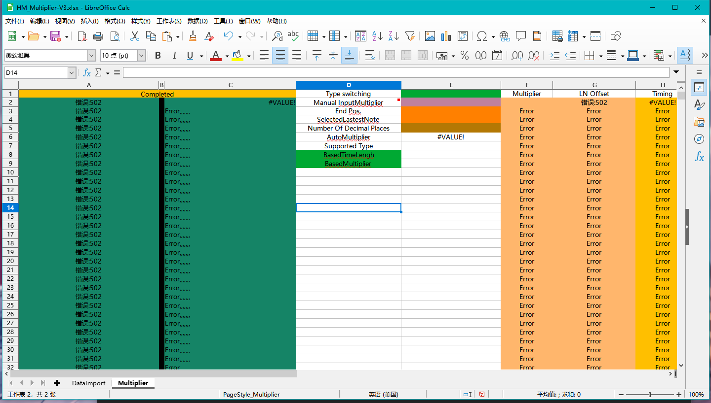

## Multiplier

---

After importing the data, go to the Multiplier worksheet and after filling in the information, the blue and green columns are the normal Note or Object that have been converted and are placed in the .osu file under [TimingPoints] [HitObjects] respectively.

The former supports manual input of the multiplier and the calculation of the multiplier between two Notes, the latter supports the multiplier format for Timing and Object.

TypeSwitching is the mode switch, i.e. the two multiplier modes.

- BasedTimeLength

This mode relies on the calculation of the length of time, i.e. the multiplication between Notes. This mode only requires the data originally imported and the data of the Note to be multiplied and the last Note that has been selected to be automatically multiplied.

You need to fill in End Pos. and SelectedLastestNote, the end position of the target multiplier and the last one of the selected Note. If the last Note is a LongNote it may be necessary to place a Note at the end of the LongNote before copying it to avoid errors.

- BasedMultiplier

The variable speed mode relies on the manual input multiplier, which can be calculated by simply filling in the Manual InputMultiplier.

Once the data has been calculated, the blue and green columns are the results.

This is not the most simplified at the moment, wait for the changes later.