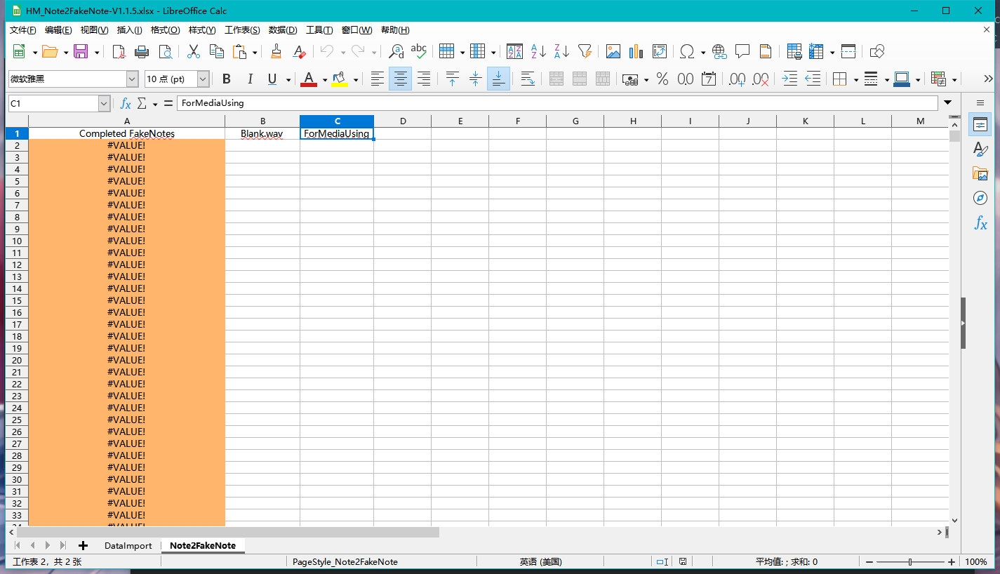

## Note To FakeNote

---

After importing the data to the Note2FakeNote worksheet, the yellow column is the completed conversion of FakeNote, put it into the score file that needs to be converted to FakeNote under [HitObjects] in osu.

In addition to this, the left-hand side of ForMediaUsing is the name of the sample file used by FakeNote, which can be used to batch-modify the sound and mute the fakeNote, but for some reason it doesn't work at all, so I'll leave it for now until it's fixed.