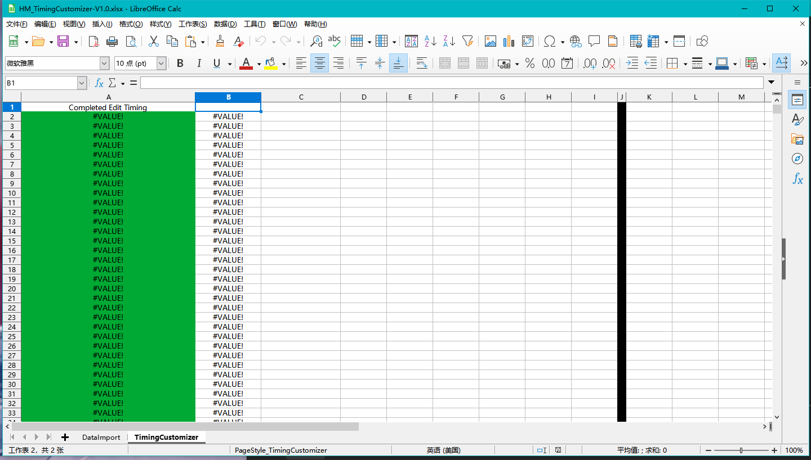

## TimingCustomizer

---

After importing the data go to the second worksheet and modify the content. Finally it will be composited back into the green column to become the complete Timing data.

As the name suggests, data customisation. Any data can be modified within this tool, as long as it does not exceed the limits of the osu format. The finished data can then be placed in the spectrum file .osu.

However, it is not necessary to save the data when using this tool. Otherwise the original structure will be destroyed and the next use will be invalid.
