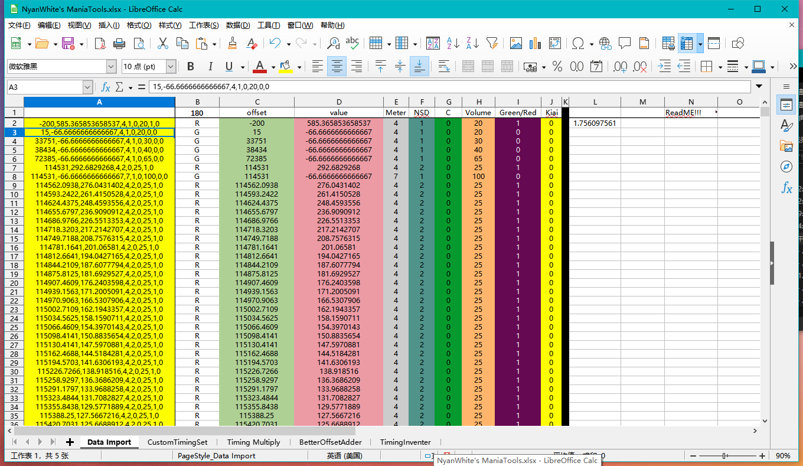
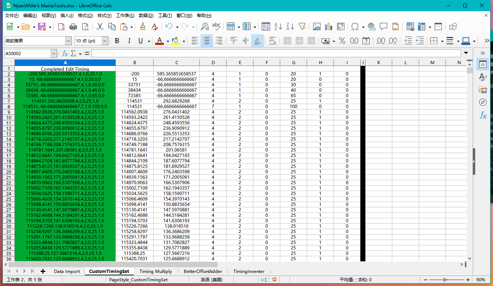
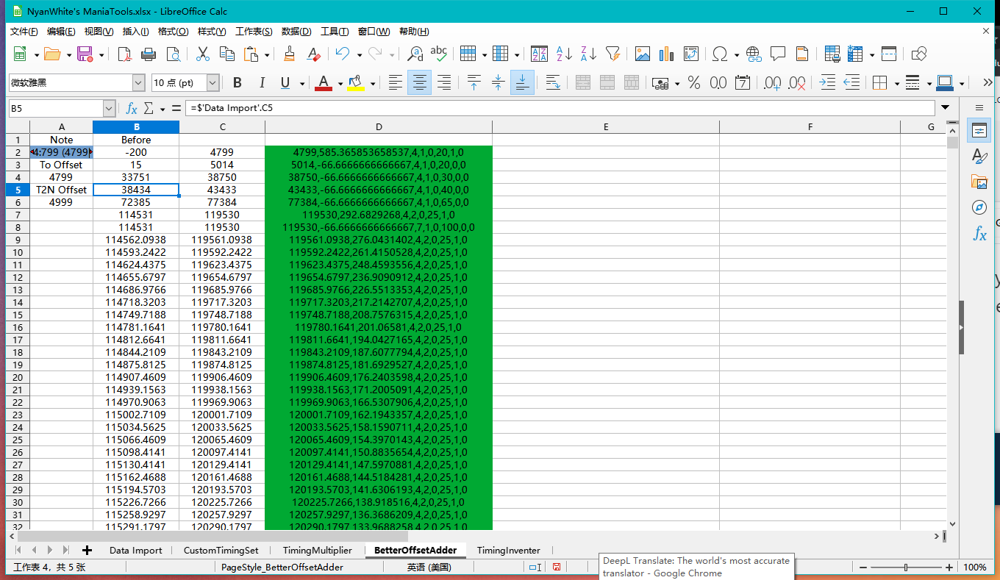
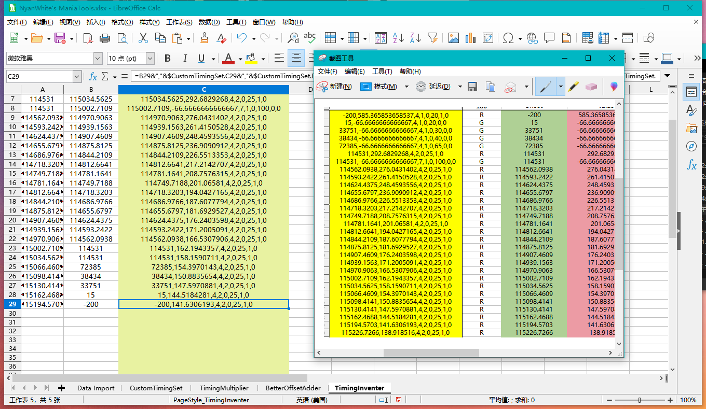

ú# NyanWhite-Customizer-Mania-Tools
Sample Excel Document

---

An Excel document with many tools, still WIP, feedback welcome.

Supports up to 50,000 timings, beyond which it will be unreadable. More timings can be supported by confidently copying the formula column and adding it to the end.

---

## What it can do

### Expanded Timing Data

> Reads data more clearly and exists as a dependency on some worksheets.

---

### Customize The TimingData Of All Items

> This form allows the user to change any of the data except for the green columns, which will eventually be merged into the complete Timing.

**If you use this worksheet, then do not save the document when you exit.**

---

### TimingMultiplier

The worksheet is still in production so it is not available, you can download it and view it.

---

### BetterOffseter

> TimingOffsetters based on object timing are easier to use than manual input re-offsets, and also facilitate object-dependent Timing alignment without using osu!'s own object re-alignment tool in the event of >1ms deviations caused by incomplete timing divisions.

### About Object Data Splitting Version

BetterOffseter can now be used in three modes other than OSUMania mode, simply by switch the version of the splitting function

#### V1

Perfectly Work In OSU!Mania mode, taking the initial object timestamp to determine the offset position.

#### V2

relies on the minutes, seconds, and milliseconds of the starting point of the copied object. This splitting algorithm works in all four modes without using the object's timestamp for the target location calculation.

---

### TimingReverser

> Flipping the timing from bottom to top seems to have some bugs, but not a steady occurrence. The number of timings supported here relies on the amount of data imported and requires manual copying of the formula columns. B1 will give the number of valid timings, simply copy columns A,B and C to the specified number of rows. Otherwise an error will occur which will affect the normal operation of the flipper.

**Some data needs to be changed manually**

---

### Aligning Objects to Timing

~~Experimental Features~~

---

### Note2FakeNote

**Not available in LongNote, born from feature of LongNote.**

> Generate fake notes based on object timestamps, this feature is fully implemented by using a mapping file with mania-xT.png in osu. Otherwise it will disappear and not be visible. Also, this tool requires the .osu file to be opened for operation. Later on, it may be possible to generate from copied content, but it is still necessary to add text in the osu file, which is not available in the osu editor, and the note is likely to disappear when saving the existing fake note. Please be careful when using it.

---

# Special thanks

datoujia:Frame Animation Generator,and more Converter

Open Source Office:Libra Office

And User,You!

---

### To do List

- [x] Timing Data Analysis

- [x] CustomizeTiming

- [ ] TimingMultiplier

- [x] BetterOffseter

- [x] TimingReverser

- [ ] By Timimg_Object Aligner

- [ ] Note2FakeNote

---

- Contact Me

QQ2282983971 Or Email 2282983971@qq.com
